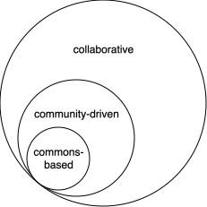

<!--
SPDX-FileCopyrightText: 2025 comodelling.org contributors: https://github.com/comodelling/comodelling-website/CONTRIBUTORS.md
SPDX-License-Identifier: CC-BY-SA-4.0
-->

*Comodelling* is an initative to facilitate co-modelling efforts.
But what's "co-modelling"?

# Co-modelling

"Co-modelling" refers to the practice of modelling together, for, by or across [communities](../communities.md).

It can take the form of various collective [practices](../practices/index.md), make use of different tools and platforms.

It suggests collective intentionality and control at different steps of the [co-modelling process](#the-process-of-co-modelling).

## What?

Co-modelling supposes to have an idea about *what* we want to model.

We distinguish between different levels that jointly define the object of study:

* the *intended object*: what the model/project/platform aims/is supposed to represent
* the *models* that abstract and structure information
* the *product* or *outputs*, what actually comes out of the co-modelling process

However, we are not prescribing what should be modelled, and we encourage communities to think freely about what they want to model.

## For what?

Broadly, a community might want to model information that matters most to itself or others.
This raises the questions:

* **relevance**: what's most relevant to different communities, at different points in time and space?
* **benefit**: what would benefit the community, or others?
* **purpose**: what is the community trying to achieve?

This should be up to people and communities to answer this.

These questions can be used to guide the modelling choices: is this model relevant? What purpose is it pursuing? Whom is it benefiting?

## The process of co-modelling

Co-modelling is a collective, dynamic process. 
Here we suggest several steps, though this template might differ among projects:

1. Before (co-defining):
    - Define the model and intent behind it
    - Choose the tools that structure the co-modelling process
2. During (co-producing):
    - Produce information according to the model, using the tools and rules
    - Learn from the outputs, interrogate them, refine choices if necessary

## The "co" in co-modelling

The "co" in "co-modelling" is flexible, and can suggest for example that the co-modelling process is collaborative, for the community, community-driven, or commons-based.

  

We attempt some definitions below:

- Collaborative simply suggests that different people work together in the process.

- Community-driven stresses that the community is in control of the process.

- Commons-based builds on the idea of community-driven, but with an added layer infused with the values and ideas revolving around the commons

Another possible sense of co-modelling, though maybe less primordial than the first one, is to consider various objects together, inviting us to think through the co-dependencies or evolutions between different objects of studies.

## An alternative paradigm

The idea of co-modelling provides an alternative paradigm to that of social media, of market prediction platforms and other business-oriented crowdsourcing. Sure, those might be effective at optimising certain specific things by using users' input, but they benefit only a few while alienating many.
Instead of enabling us to work together on the issues that affect us, these platforms mostly just keep throwing oil at the giant artificial fire which the modern Internet has become.

We believe that there are other ways forward, leveraging our collective modelling power in ways that empower people, not allienate them.
Co-modelling gives communities control and agency, by letting them decide and agree on the questions, purposes, conditions, criteria, parameters, or rules of their models and processes.
The stakes are high when it comes to shaping the knowledge systems that structure information at different scales.
These systems directly inform our possible futures. Let's build them together.